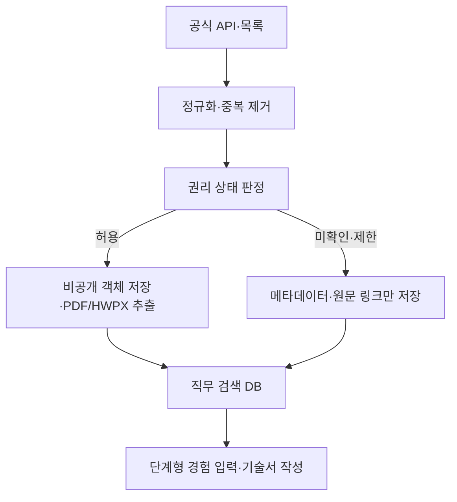

# Job&Kill Public

대한민국 공공기관·공기업의 채용공고와 NCS 직무정보를 **미리 수집·정규화**하고, 사용자가 자신의 실제 경험을 단계별로 입력해 경력기술서 또는 경험기술서를 작성하는 MVP입니다.

이 서비스는 사용자가 문서를 만들 때마다 웹을 다시 검색하지 않습니다. 운영 수집 작업이 공식 소스를 주기적으로 동기화하고, 웹/API는 미리 축적된 데이터베이스만 조회합니다.

## 지금 구현된 범위

- 공공데이터포털 공식 채용정보 API JSON/XML 수집기
- NCS 등록 직무기술서 목록의 보수적 메타데이터 수집기(기본 비활성)
- 기관·공고·첨부파일·직무 프로필의 중복 없는 누적 저장
- PDF/HWPX의 직무수행내용·필요지식·필요기술·태도·자격 섹션 추출
- 필드별 원문 URL·PDF 페이지·발췌 근거 저장
- 문서별 권리 상태 및 판정 이력. 승인 전 원문 다운로드 자동 차단
- 기관/직무/NCS 검색 API
- 8단계 모바일 우선 작성 화면과 브라우저 자동 저장
- 이메일 매직링크 로그인, CSRF 보호, 계정 초안 버전·충돌 관리
- SQLite 개발 모드와 PostgreSQL 운영 모드
- 로컬 개발 저장소와 암호화된 S3 호환 문서 저장소
- 업로드 의도·삭제 재시도·저장 위치 고정을 기록하는 영속 객체 정리 큐
- 수동 최초 전체 수집과 매일 갱신을 분리한 GitHub Actions
- 개조식·스토리텔링 출력, 누락 사실의 `[확인 필요]` 표시
- 블라인드 채용 민감정보 및 팀 성과 과장 경고
- Ponytail v4.9.0 저장소 기본 플러그인 설정

### 수집 범위 현황

| 범위 | 공식 소스 | 구현 상태 |
|---|---|---|
| 중앙 공공기관·공기업 채용 | 공공데이터포털/ALIO API | 수집기 완료, 서비스키 연결 필요 |
| NCS 등록 직무기술서 | NCS 공정채용 | 메타데이터 수집기 완료, 정책 검토 후 활성화 |
| 지방공기업·지방출자출연기관 | Cleaneye Job+ | 소스·권리 모델 등록, 공식 연계방식 협의 필요 |
| NCS 학습모듈 | NCS | 상업적 이용 제한으로 수집 대상 제외 |

## 실행

Python 3.11 이상이 필요합니다.

```bash
python -m venv .venv
source .venv/bin/activate
python -m pip install -r requirements.txt
python -m jobandkill init
python -m jobandkill serve
```

브라우저에서 `http://127.0.0.1:8787`을 엽니다. 작성 내용은 먼저 브라우저에 저장됩니다. 로그인한 사용자가 명시적으로 동의하면 계정에도 버전 관리하여 저장하며, 초안 생성 자체는 로그인 없이 사용할 수 있습니다.

테스트:

```bash
python -m unittest discover -s tests -v
```

## 공식 채용정보 수집 연결

1. [공공데이터포털의 공공기관 채용정보 조회서비스](https://www.data.go.kr/data/15125273/openapi.do)에서 활용신청합니다.
2. 발급 화면에 표시되는 **정확한 호출 URL**을 `.env.example` 형식으로 설정합니다. 이 저장소는 로그인 후에만 보이는 엔드포인트를 추측해 하드코딩하지 않습니다.
3. 자리표시자 `{service_key}`, `{page}`, `{page_size}`는 그대로 둡니다.

```bash
export JOBNKILL_ALIO_API_URL_TEMPLATE='https://apis.data.go.kr/...?...&serviceKey={service_key}&pageNo={page}&numOfRows={page_size}&type=json'
export JOBNKILL_ALIO_SERVICE_KEY='발급받은-키'
python -m jobandkill doctor --require-api
python -m jobandkill sync --source data-go-kr-alio --full
```

기본 설정은 100건씩 최대 10페이지로, 개발계정의 일일 1,000회 제한을 넘지 않도록 보수적으로 동작합니다. 운영계정의 승인량에 맞춰 `JOBNKILL_PAGE_SIZE`와 `JOBNKILL_MAX_PAGES`를 조정할 수 있습니다.

공식 API 응답을 먼저 내려받은 경우에는 네트워크 호출 없이 가져올 수도 있습니다.

```bash
python -m jobandkill import official-response.json --source data-go-kr-alio
```

가져오기 파일은 기준시점을 검증할 수 없으므로 기존 첨부문서의 권리 상태를 바꾸지 않습니다. 새 첨부도 자동 승인하지 않고 `review_required`로 등록합니다.

최초 전체 수집은 `--full`로 최대 1,000페이지까지 확인합니다. API의 `totalCount`에 도달하지 못하거나, 첨부 항목이 비정상 형식이거나, 권리 정리 대기열이 남으면 `partial`을 반환하고 명령도 성공으로 간주하지 않습니다. 비정상 첨부 응답은 기존 파일이 제거됐다는 근거로 사용하지 않으므로 이미 확인된 권리를 오인 철회하지 않습니다. 이후 갱신은 같은 레코드를 다시 받아도 중복되지 않는 방식으로 동작합니다. `.github/workflows/sync.yml`은 수동 전체 수집과 한국시간 03:35 일일 갱신을 분리하며, 사용자 웹 요청에서는 수집기를 호출하지 않습니다.

## 첨부 PDF 권리 게이트

공개된 PDF라고 해서 상업 서비스가 자동으로 복제·재배포할 수 있는 것은 아닙니다. 수집기는 공고 메타데이터와 첨부문서의 권리를 분리합니다.

| 상태 | 원문 저장·추출 | 사용자 제공 방식 |
|---|---:|---|
| `open_document` | 허용 | 출처·라이선스와 함께 구조화 |
| `authorized` | 허용 | 별도 허가 근거와 함께 구조화 |
| `review_required` | 차단 | 메타데이터와 공식 링크만 노출 |
| `metadata_only` | 차단 | 메타데이터와 공식 링크만 노출 |
| `restricted` | 차단 | 서비스 수집 대상에서 제외 |

법무·콘텐츠 관리자가 허가 증빙을 확인한 뒤에만 상태를 바꿉니다.

```bash
python -m jobandkill rights-info 42
python -m jobandkill rights 42 authorized \
  --reason '기관의 2026-09-01 서면 허가 확인' \
  --by 'content-admin@example.com' \
  --expected-identity 'rights-info가 표시한 identity 값'
python -m jobandkill process-documents
```

`open_document` 또는 `authorized`로 허용할 때는 먼저 `rights-info`의 현재 URL·제목·라이선스·해시·권리/피드 리비전을 검토하고 동일한 `identity`를 전달해야 합니다. 검토 뒤 공식 피드가 첨부를 교체·제거했거나 더 최신 제한 판정이 기록됐다면 명령은 오래된 승인을 적용하지 않고 거부합니다. 제한·철회 판정은 이 토큰 없이 즉시 적용할 수 있습니다.

이미 저장한 문서의 권리가 `restricted`, `metadata_only`, `review_required`로 변경되면 객체 원문, 추출문, 해당 문서에서 만든 직무 프로필을 함께 제거합니다. 공식 첨부목록에서 파일이 사라지거나 URL·라이선스 등 식별정보가 바뀌어도 기존 승인과 추출 결과를 승계하지 않습니다. 동일 URL의 원문도 기본 7일 간격으로 다시 해시를 확인하며, 별도 허가(`authorized`) 문서의 바이트가 바뀌면 새 원문을 저장하지 않고 재승인을 요구합니다.

삭제는 영속 재시도 큐로 처리합니다. 업로드 의도는 첨부 ID와 작업 토큰에 묶여 있어 업로드 도중 권리가 철회돼도 대상 객체를 찾아 정리합니다. 일시적 S3 오류나 배치 한도를 넘은 즉시 처리 대기열은 성공으로 숨기지 않으며 `--fail-on-error`가 비정상 종료합니다. 이전 버전의 저장 경로를 검증할 수 없는 객체는 사용자 제공 대상에서 즉시 차단하고 `quarantined`로 보고합니다. 데이터베이스는 최초 문서 저장 위치를 고정하므로 로컬 루트·S3 버킷·엔드포인트를 바꾸려면 기존 객체를 먼저 정리하거나 명시적으로 이전해야 합니다.

NCS 학습모듈은 공공누리 제2유형(상업적 이용 금지) 안내에 따라 기본적으로 `restricted`입니다. NCS 등록 직무기술서는 문서별 공공누리 표시와 제3자 권리를 확인하며, 확인 전에는 [NCS 저작권정책](https://www.ncs.go.kr/unity/th01/selectPolicyPopView.do)과 공식 원문으로만 연결합니다.

## 데이터 흐름



핵심 공개 데이터 테이블은 `sources`, `sync_runs`, `institutions`, `postings`, `attachments`, `job_profiles`, `extraction_evidence`, `rights_decisions`입니다. 원문 객체 상태는 `document_objects`, `document_gc_queue`, `storage_namespaces`에, 계정 데이터는 `users`, `login_tokens`, `sessions`, `user_drafts`에 분리합니다. 원본 응답의 해시와 JSON도 함께 남겨 갱신과 감사를 추적합니다.

## 운영 전 필수 작업

- 공공데이터포털 운영계정 활용신청 및 트래픽 승인
- NCS·기관별 첨부문서 이용범위 법무 검토와 필요한 별도 허가
- PostgreSQL 백업·복구 검증과 S3 비공개/암호화 정책 적용. 전용 원문 버킷은 버전 관리 비활성화
- 배포 플랫폼의 TLS, 프록시 요청 제한, SMTP 연결
- 바이너리 HWP 변환기 및 스캔 PDF용 한국어 OCR 작업 큐
- 운영 배포 후 320/390/768/1440px 시각 QA

운영 값은 채팅이나 저장소에 넣지 않습니다. `requirements-production.txt`를 설치하고 `JOBNKILL_DATABASE_URL`, S3, SMTP, 공개 HTTPS 주소를 배포 플랫폼의 Secret Manager 또는 GitHub Environment에 설정한 뒤 아래 점검을 통과시켜야 합니다. 전체 절차는 `docs/operations.md`에 있습니다.

```bash
python -m jobandkill doctor --production --require-api
```

## 주요 명령

```bash
python -m jobandkill status
python -m jobandkill sync --all
python -m jobandkill sync --source data-go-kr-alio --full
python -m jobandkill process-documents --limit 20
python -m jobandkill serve --host 127.0.0.1 --port 8787
```
