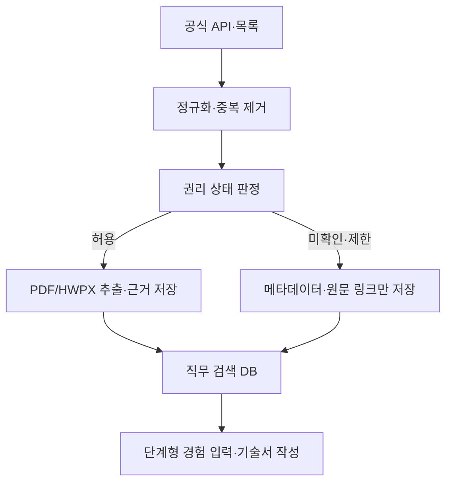

# Job&Kill Public

대한민국 공공기관·공기업의 채용공고와 NCS 직무정보를 **미리 수집·정규화**하고, 사용자가 자신의 실제 경험을 단계별로 입력해 경력기술서 또는 경험기술서를 작성하는 MVP입니다.

이 서비스는 사용자가 문서를 만들 때마다 웹을 다시 검색하지 않습니다. 운영 서버의 수집 작업이 공식 소스를 주기적으로 동기화하고, 웹/API는 축적된 로컬 데이터베이스만 조회합니다.

## 지금 구현된 범위

- 공공데이터포털 공식 채용정보 API JSON/XML 수집기
- NCS 등록 직무기술서 목록의 보수적 메타데이터 수집기(기본 비활성)
- 기관·공고·첨부파일·직무 프로필의 중복 없는 누적 저장
- PDF/HWPX의 직무수행내용·필요지식·필요기술·태도·자격 섹션 추출
- 필드별 원문 URL·PDF 페이지·발췌 근거 저장
- 문서별 권리 상태 및 판정 이력. 승인 전 원문 다운로드 자동 차단
- 기관/직무/NCS 검색 API
- 8단계 모바일 우선 작성 화면과 브라우저 자동 저장
- 개조식·스토리텔링 출력, 누락 사실의 `[확인 필요]` 표시
- 블라인드 채용 민감정보 및 팀 성과 과장 경고
- Ponytail v4.9.0 저장소 기본 플러그인 설정

### 수집 범위 현황

| 범위 | 공식 소스 | 구현 상태 |
|---|---|---|
| 중앙 공공기관·공기업 채용 | 공공데이터포털/ALIO API | 수집기 완료, 서비스키 연결 필요 |
| NCS 등록 직무기술서 | NCS 공정채용 | 메타데이터 수집기 완료, 정책 검토 후 활성화 |
| 지방공기업·지방출자출연기관 | Cleaneye Job+ | 소스·권리 모델 등록, 공식 연계방식 협의 필요 |
| NCS 학습모듈 | NCS | 상업적 이용 제한으로 수집 대상 제외 |

## 실행

Python 3.11 이상이 필요합니다.

```bash
python -m venv .venv
source .venv/bin/activate
python -m pip install -r requirements.txt
python -m jobandkill init
python -m jobandkill serve
```

브라우저에서 `http://127.0.0.1:8787`을 엽니다. 사용자 작성 내용은 브라우저 `localStorage`에 임시 저장되고, 초안 생성 API는 내용을 서버 DB에 저장하지 않습니다.

테스트:

```bash
python -m unittest discover -s tests -v
```

## 공식 채용정보 수집 연결

1. [공공데이터포털의 공공기관 채용정보 조회서비스](https://www.data.go.kr/data/15125273/openapi.do)에서 활용신청합니다.
2. 발급 화면에 표시되는 **정확한 호출 URL**을 `.env.example` 형식으로 설정합니다. 이 저장소는 로그인 후에만 보이는 엔드포인트를 추측해 하드코딩하지 않습니다.
3. 자리표시자 `{service_key}`, `{page}`, `{page_size}`는 그대로 둡니다.

```bash
export JOBNKILL_ALIO_API_URL_TEMPLATE='https://apis.data.go.kr/...?...&serviceKey={service_key}&pageNo={page}&numOfRows={page_size}&type=json'
export JOBNKILL_ALIO_SERVICE_KEY='발급받은-키'
python -m jobandkill sync --source data-go-kr-alio
```

기본 설정은 100건씩 최대 10페이지로, 개발계정의 일일 1,000회 제한을 넘지 않도록 보수적으로 동작합니다. 운영계정의 승인량에 맞춰 `JOBNKILL_PAGE_SIZE`와 `JOBNKILL_MAX_PAGES`를 조정할 수 있습니다.

공식 API 응답을 먼저 내려받은 경우에는 네트워크 호출 없이 가져올 수도 있습니다.

```bash
python -m jobandkill import official-response.json --source data-go-kr-alio
```

운영 서버에서는 크론 또는 작업 큐에서 아래 명령을 하루 한 번 실행합니다. 사용자 웹 요청 경로에서는 수집기를 호출하지 않습니다.

```cron
35 3 * * * cd /srv/jobandkill && .venv/bin/python -m jobandkill sync --all >> /var/log/jobandkill-sync.log 2>&1
20 4 * * * cd /srv/jobandkill && .venv/bin/python -m jobandkill process-documents --limit 50 >> /var/log/jobandkill-documents.log 2>&1
```

## 첨부 PDF 권리 게이트

공개된 PDF라고 해서 상업 서비스가 자동으로 복제·재배포할 수 있는 것은 아닙니다. 수집기는 공고 메타데이터와 첨부문서의 권리를 분리합니다.

| 상태 | 원문 저장·추출 | 사용자 제공 방식 |
|---|---:|---|
| `open_document` | 허용 | 출처·라이선스와 함께 구조화 |
| `authorized` | 허용 | 별도 허가 근거와 함께 구조화 |
| `review_required` | 차단 | 메타데이터와 공식 링크만 노출 |
| `metadata_only` | 차단 | 메타데이터와 공식 링크만 노출 |
| `restricted` | 차단 | 서비스 수집 대상에서 제외 |

법무·콘텐츠 관리자가 허가 증빙을 확인한 뒤에만 상태를 바꿉니다.

```bash
python -m jobandkill rights 42 authorized \
  --reason '기관의 2026-09-01 서면 허가 확인' \
  --by 'content-admin@example.com'
python -m jobandkill process-documents
```

NCS 학습모듈은 공공누리 제2유형(상업적 이용 금지) 안내에 따라 기본적으로 `restricted`입니다. NCS 등록 직무기술서는 문서별 공공누리 표시와 제3자 권리를 확인하며, 확인 전에는 [NCS 저작권정책](https://www.ncs.go.kr/unity/th01/selectPolicyPopView.do)과 공식 원문으로만 연결합니다.

## 데이터 흐름



핵심 테이블은 `sources`, `sync_runs`, `institutions`, `postings`, `attachments`, `job_profiles`, `extraction_evidence`, `rights_decisions`입니다. 원본 응답의 해시와 JSON도 함께 남겨 갱신과 감사를 추적합니다.

## 운영 전 필수 작업

- 공공데이터포털 운영계정 활용신청 및 트래픽 승인
- NCS·기관별 첨부문서 이용범위 법무 검토와 필요한 별도 허가
- 운영 DB 백업과 문서 스토리지 암호화
- 인터넷 공개 시 TLS, 관리자 인증, API 속도 제한을 제공하는 리버스 프록시
- 바이너리 HWP 변환기 및 스캔 PDF용 한국어 OCR 작업 큐
- 다중 서버 운영 시 SQLite를 PostgreSQL로, 로컬 문서 폴더를 객체 스토리지로 교체

현재 SQLite 구성은 단일 서버 MVP와 데이터 모델 검증에 적합합니다. 테이블과 수집/작성 경계를 유지한 채 PostgreSQL로 이전할 수 있도록 SQL 접근을 백엔드 내부에 모았습니다.

## 주요 명령

```bash
python -m jobandkill status
python -m jobandkill sync --all
python -m jobandkill process-documents --limit 20
python -m jobandkill serve --host 127.0.0.1 --port 8787
```
